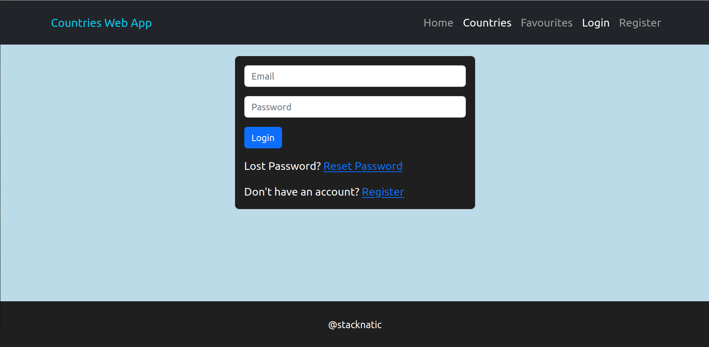
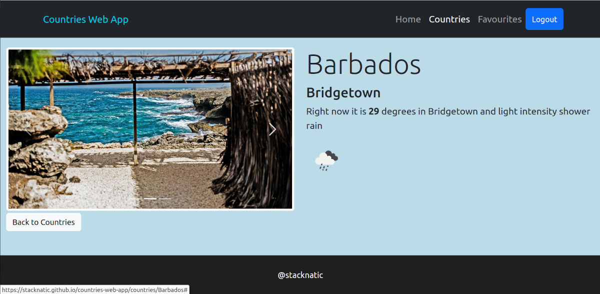

# React Countries Info Web App

## Technology

- React Router Dom.

- React Redux and React Redux Toolkit​​​​​​.

- Firebase Authentication.

- Bootstrap.

## Description 

### The app displays country cards with the following information about each country

- Language.

- Currency.

- Population.

**When you click on a country card, you are navigated to a detailed view of the country card with the following infomation:**

- Current weather in the country capital.

- An image slider that displays 3 images about the country.

- You can also add countries as favourites.

 
### App Background Info

**The project was inspired by @martin-holland's Country App lesson.** 

**Additional features:**

- Added additional password field (confirmation) to the registration form to ensure that a user doesn't mistakenly register with the wrong password.

- Added password reset link.

- Added logic to remove 'login and register' links if user is logged in.

- Added logic to load a maximum of 20 pages at a time and load more when user scrolls to the bottom of the page. This is to ensure that the page loads fast on first visit. A bootstrap spinner is displayed while more countries are loading.

- Added slides to countriesSingle.jsx (3 images)

- Styled login and registration forms

- Fixed header to top.

- Added footer.

### Screenshots

### Demo

Live url: [countries app](https://stacknatic.github.io/countries-web-app)

- email = demo@example.com

- password = password

